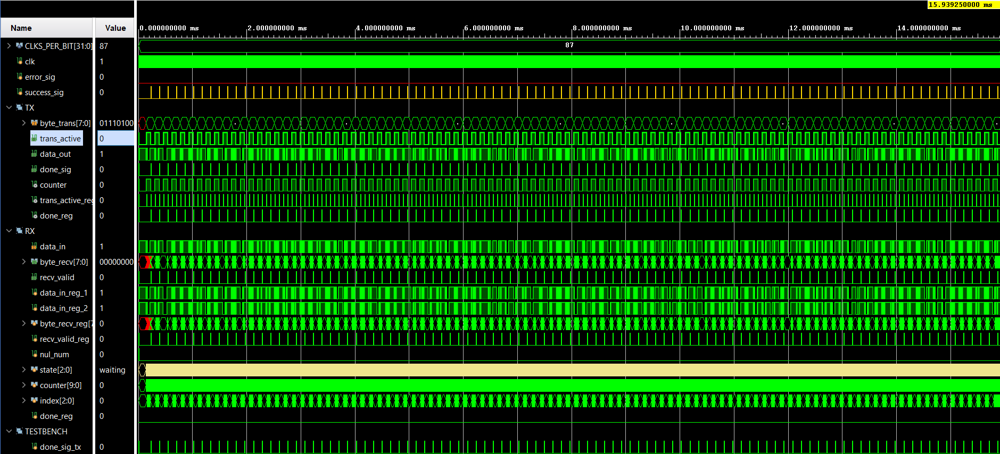
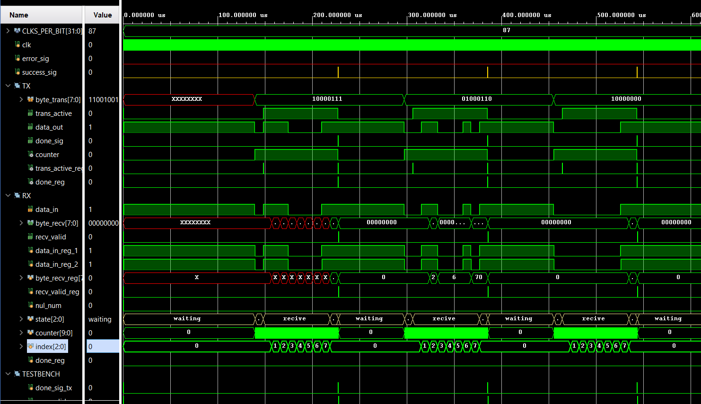

# UART Design (without parity bit)

This repository contains a UART (Universal Asynchronous Receiver/Transmitter) design implemented in SystemVerilog, consisting of two main modules: `uart_tx` (transmitter) and `uart_rx` (receiver), along with a testbench for simulation and testing.

## Project Structure
srs:
- **uart_tx.sv**: The UART transmitter module, responsible for sending data.
- **uart_rx.sv**: The UART receiver module, responsible for receiving data.
- **uart_arb_tb.sv**: The UART arbiter controls the process of sending data from the FPGA to the computer.

testbench:
- **uart_tb.sv**: The testbench used to verify the design by simulating data transmission between the transmitter and receiver.
- **uart_tx.sv**: The testbench used to verify only Transmitter.
- **uart_rx.sv**: The testbench used to verify only Receiver.
- **uart_arb_tb.sv**: The testbench used to verify only Arbiter.

log (log files as a result of design):
- **runme.log**.
- **simulate.log**.

waveform:
- **uart_tb_behav.wcfg**.

## Overview of UART Design

UART is a hardware communication protocol that uses asynchronous serial communication, which means data is transmitted without a clock signal. Instead, start and stop bits are used to synchronize data transmission between the sender and receiver.

### UART Transmitter (`uart_tx`)

The UART transmitter (`uart_tx`) sends data serially by encoding the data along with start and stop bits. This module implements a finite state machine (FSM) with the following states:

- **waiting**: Idle state, waiting for the `data_ready` signal to begin transmission.
- **start**: Sends the start bit (logic 0) to indicate the start of transmission.
- **trans_data**: Transmits the 8-bit data, one bit at a time.
- **stop**: Sends the stop bit (logic 1) to mark the end of transmission.
- **done**: Indicates the completion of the transmission.

**Parameters**:
- `CLKS_PER_BIT`: Defines the number of clock cycles per bit, which is determined by the UART baud rate.

**Ports**:
- `clk`: Clock signal.
- `data_ready`: Signal indicating that data is ready for transmission.
- `byte_trans`: 8-bit data to be transmitted.
- `trans_active`: Signal indicating that transmission is ongoing.
- `data_out`: Serial output data.
- `done_sig`: Signal indicating that the transmission is complete.

### UART Receiver (`uart_rx`)

The UART receiver (`uart_rx`) receives serial data, decodes the start, data, and stop bits, and outputs the 8-bit data. Like the transmitter, this module implements an FSM to manage its operation:

- **waiting**: Idle state, waiting for the start bit.
- **start**: Detects the start bit and prepares for data reception.
- **recive**: Receives the 8-bit data, one bit at a time.
- **stop**: Verifies the stop bit.
- **done**: Marks the completion of reception.

### UART Arbiter (`uart_arb.sv`) and Testbench Arbiter (`uart_arb_tb.sv`)
This project includes two SystemVerilog files: uart_arb.sv and uart_arb_tb.sv, designed to facilitate data transmission between an FPGA and a computer via UART.

- `uart_arb.sv`:
This file contains the RTL description of a UART arbiter, which coordinates the data transfer between an FPGA and the computer. The arbiter manages data flow by interacting with two UART interfaces—transmitter and receiver—ensuring efficient communication. The design includes a finite state machine (FSM) that controls the process of sending data from the FPGA to the computer.

- `uart_arb_tb.sv`:
The testbench simulates the UART arbiter to verify its functionality. It includes stimulus generation and monitoring of the data transfer. The testbench ensures that the communication is successfully carried out as expected, allowing for debugging and validation before deployment on FPGA.

Both files are used to connect the FPGA to a computer via PuTTY, where data is transmitted using the UART protocol. The finite state machine within the arbiter handles the sending and receiving of data

**Parameters**:
- `CLKS_PER_BIT`: Defines the number of clock cycles per bit, matching the transmitter's baud rate.

**Ports**:
- `clk`: Clock signal.
- `data_in`: Serial input data.
- `byte_recv`: 8-bit received data.
- `recv_valid`: Signal indicating that valid data has been received.

### Testbench (`uart_tb`)

The testbench simulates the UART communication by instantiating the `uart_tx` and `uart_rx` modules. It verifies that the transmitted data matches the received data. The testbench also includes:

- Clock generation.
- Stimulus for data transmission.
- Monitoring and checking of transmitted and received data.

### Parameters in Testbench:
- `CLKS_PER_BIT`: Clock cycles per bit (baud rate).
- `CLK_PERIOD`: Clock period.
- `PERIOD_OF_BIT`: Time duration for one bit in the UART.

### Simulation Flow:
1. Random data is generated and sent via `uart_tx`.
2. `uart_rx` receives the data.
3. The testbench checks if the received data matches the transmitted data and reports any mismatches.




### Parameters

The baud rate is the `CLKS_PER_BIT` parameter. It uses to match system clock and the desired baud rate. For example, for a system clock of 10 MHz and a baud rate of 115200:

```
CLKS_PER_BIT = (10000000) / (115200) ≈ 87
```
